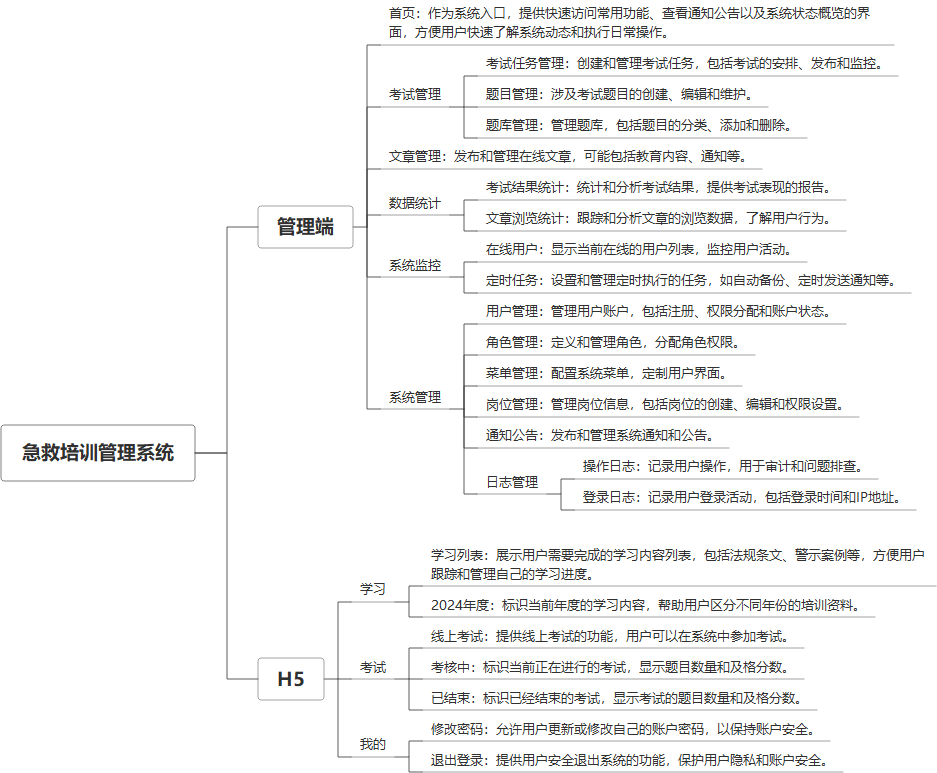

 

    
 

公司拥有上百套具有自主知识产权的软件系统，详情请查看码云首页或公司官网

 
<h1>急救培训管理系统</h1>

<a href="https://www.haishi.net.cn/">公司官网</a> ｜ <a href="https://www.haishi.net.cn/">在线体验</a>

 

## 系统介绍

考试培训管理系统系统是一款专注于医疗急救知识和技能评估的在线考试平台。该系统集成了系统监控、日志管理、数据统计、考试管理等多种功能，旨在为医疗机构、教育机构或相关企业提供高效、便捷的考试与培训解决方案。
考试培训管理系统系统是一款专注于医疗急救知识和技能评估的在线考试平台。该系统集成了系统监控、日志管理、数据统计、考试管理等多种功能，旨在为医疗机构、教育机构或相关企业提供高效、便捷的考试与培训解决方案。
本项目名称为急救培训管理系统，旨在提供急救知识培训和考试管理功能。该系统包含H5端和管理后台两个终端。
- 管理后台：面向管理员，提供考试管理、文章管理、数据统计、系统监控、系统管理等功能，可以创建考试任务、管理题库、发布文章、查看统计数据、监控系统运行状态、管理用户权限等。
- H5端：面向用户，提供学习、考试、个人中心等功能，用户可以在H5端学习急救知识、参加考试、修改密码、退出登录等。
                

## 系统功能介绍

### 系统包含终端说明

管理端（WEB）、用户端（微信小程序、H5）

| 序号 | 模块 | 模块说明 |
| --- | --- | --- |
| 1 | YL-JJPX-WJW-SERVER | 服务端 |
| 2 | YL-JJPX-WJW-H5 | H5端 |
| 3 | YL-JJPX-WJW-MANAGE | 管理端 |

### 系统功能结构

### 系统功能说明

主要功能：
- 考试管理：包括考试任务管理、题目管理、题库管理，支持创建和管理考试任务、题目和题库。
- 文章管理：支持发布和管理文章，提供急救知识学习资源。
- 数据统计：包括考试结果统计和文章浏览统计，方便管理员了解培训效果和用户学习情况。
- 用户管理：支持用户、角色、岗位管理，可以对不同用户分配不同的权限。
- H5端学习和考试：用户可以在H5端学习急救知识并参加考试。
- 系统监控：监控在线用户和定时任务，保证系统稳定运行。

## 系统主要界面

## 系统技术说明

### 代码模块说明

| 序号 | 目录 | 目录说明 |
| --- | --- | --- |
| 1 | YL-JJPX-WJW-SERVER/framework | -- |
| 2 | YL-JJPX-WJW-SERVER/admin | -- |
| 3 | YL-JJPX-WJW-SERVER/generator | -- |
| 4 | YL-JJPX-WJW-SERVER/system | -- |
| 5 | YL-JJPX-WJW-SERVER/common | -- |
| 6 | YL-JJPX-WJW-SERVER/quartz | -- |
| 7 | YL-JJPX-WJW-SERVER/.idea | -- |

### 系统技术选型

#### 开发语言/框架

JAVA（JDK1.8）

#### 服务中间件

Nginx

#### 数据库

MySQL（5.7+）

#### 其他说明

无

## 系统演示/商用

请扫码添加客服微信获取演示地址和系统详细资料。

如果您想基于急救培训管理系统进行商业化交付或定制开发服务，我们提供有偿的技术服务支持，合作模式不限，欢迎沟通！

公司官网地址： <a href="https://www.haishi.net.cn/">https://www.haishi.net.cn</a>

联系客服获取专业回答。

## 使用须知

1、 本项目商用必须获得版权所有者的授权。

2、 未经允许本项目代码不允许二次出售。

